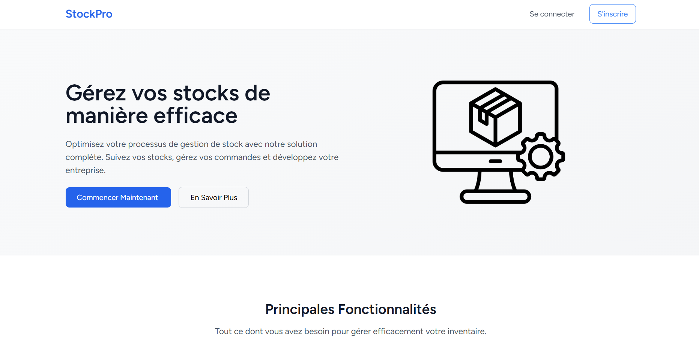

<div align="center">
  
  <br><br>
</div>

## 📋 Introduction

StockPro est une application web de gestion de stock développée avec Laravel. Elle permet de :
- Gérer les produits et leur stock
- Suivre les commandes et approvisionnements
- Générer des factures automatiquement
- Suivre les transactions (ventes et achats)
- Gérer les fournisseurs et catégories

## 🚀 Guide d'Installation

### Prérequis
- PHP >= 8.1
- Composer
- Node.js et NPM
- MySQL/MariaDB

### Installation
```bash
# Cloner le projet
git clone https://github.com/simonet85/gestion_stock.git
cd gestion_stock

# Installer les dépendances
composer install
npm install

# Configuration
cp .env.example .env
php artisan key:generate

# Base de données
php artisan migrate --seed

# Exécutez la liste les notifications
# Lancer le worker en mode daemon avec des options optimisées
php artisan queue:work --daemon --queue=notifications,default --tries=3 --timeout=90

# Démarrer l'application
php artisan serve
npm run dev
```

## 📖 Guide d'Utilisation

### Rôles Utilisateurs
| Rôle | Permissions |
|------|-------------|
| Administrateur | Accès complet |
| Gestionnaire | Gestion opérationnelle |
| Utilisateur | Consultation uniquement |

### Fonctionnalités Principales
- **Gestion des Produits**: Ajout, modification, suivi du stock
- **Commandes**: Création, suivi, validation
- **Factures**: Génération automatique, export PDF
- **Transactions**: Suivi des ventes et achats

## 🔄 Améliorations Possibles
- Intégration de paiements en ligne
- Application mobile
- Rapports analytiques avancés
- Système de notifications amélioré
- API REST pour intégrations externes

## 📝 Conclusion

StockPro offre une solution complète pour la gestion de stock, adaptée aux besoins des entreprises modernes. Le système est :
- Sécurisé
- Facile à utiliser
- Évolutif
- Bien documenté

## 📄 License

Ce projet est sous licence [MIT](https://opensource.org/licenses/MIT).

